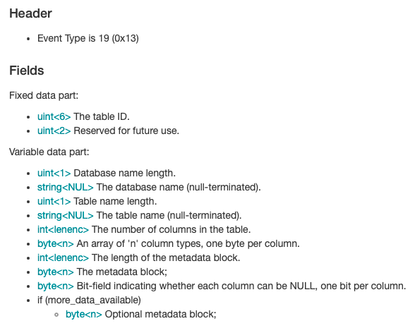
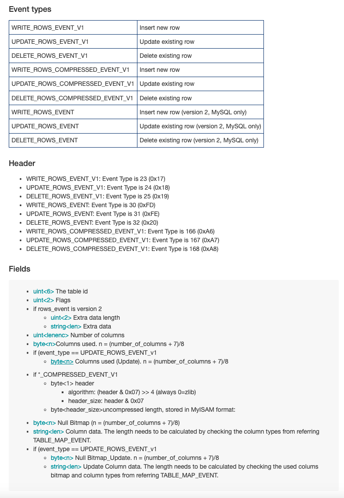

## CDC Process

A common binlog stream reader contains the parts as follows. However, in many open source library or project, some important steps are boxed as internal processes. Frequently, user should only concern about the connection to the server and how to handle the BinlogEvents. I will use [rust-mysql-cdc](https://github.com/rusuly/mysql_cdc) to introduce the whole process of mysql cdc.

### Connect to MySQL Server & Authentication

```rust
pub fn connect(&self) -> Result<(PacketChannel, DatabaseProvider), Error> {
        let mut channel = PacketChannel::new(&self.options)?;
        let (packet, seq_num) = channel.read_packet()?;
        check_error_packet(&packet, "Initial handshake error.")?;
        let handshake = HandshakePacket::parse(&packet)?;
        let auth_plugin = self.get_auth_plugin(&handshake.auth_plugin_name)?;
        self.authenticate(&mut channel, &handshake, auth_plugin, seq_num + 1)?;
        Ok((channel, DatabaseProvider::from(&handshake.server_version)))
    }

```

1. User provides the connection info and get one PacketChannel(TCPStream).
2. Get authentication method and authenticate

### Register as a slave

[RegisterSlave](https://mariadb.com/kb/en/com_register_slave/)

In Rust, we need to construct a message and send to the PacketChannel as above which includes

* COM_REGISTER_SLAVE command
* server_id
* **Empty** host user password port rank masterid

```rust
impl RegisterSlaveCommand {
    pub fn new(server_id: u32) -> Self {
        Self { server_id }
    }

    pub fn serialize(&self) -> Result<Vec<u8>, io::Error> {
        let mut vec = Vec::new();
        let mut cursor = Cursor::new(&mut vec);

        cursor.write_u8(CommandType::RegisterSlave as u8)?;
        cursor.write_u32::<LittleEndian>(self.server_id)?;

        //Empty host, user, password, port, rank, masterid
        cursor.write_u8(0)?;
        cursor.write_u8(0)?;
        cursor.write_u8(0)?;
        cursor.write_u16::<LittleEndian>(0)?;
        cursor.write_u32::<LittleEndian>(0)?;
        cursor.write_u32::<LittleEndian>(0)?;

        Ok(vec)
    }
}
```

### Binlog Dump

Same as RegisterSlave, DumpBinogCommand needs:

* server_id
* binlog_filename
* binlog_position

```rust
pub struct DumpBinlogCommand {
    pub server_id: u32,
    pub binlog_filename: String,
    pub binlog_position: u32,
    pub flags: u16,
}

impl DumpBinlogCommand {
    pub fn new(server_id: u32, binlog_filename: String, binlog_position: u32) -> Self {
        Self {
            server_id,
            binlog_filename,
            binlog_position,
            flags: 0,
        }
    }

    pub fn serialize(&self) -> Result<Vec<u8>, io::Error> {
        let mut vec = Vec::new();
        let mut cursor = Cursor::new(&mut vec);

        cursor.write_u8(CommandType::BinlogDump as u8)?;
        cursor.write_u32::<LittleEndian>(self.binlog_position)?;
        cursor.write_u16::<LittleEndian>(self.flags)?;
        cursor.write_u32::<LittleEndian>(self.server_id)?;
        cursor.write(self.binlog_filename.as_bytes())?;

        Ok(vec)
    }
}
```

### Handle Binlog Events

As mentioned above, usually, we let users handle these events but firstly, we need to parse them.

### HeartBeats

```rust
    pub fn set_master_heartbeat(&mut self, channel: &mut PacketChannel) -> Result<(), Error> {
        let milliseconds = self.options.heartbeat_interval.as_millis();
        let nanoseconds = milliseconds * 1000 * 1000;
        let query = format!("set @master_heartbeat_period={}", nanoseconds);
        let command = QueryCommand::new(query.to_string());
        channel.write_packet(&command.serialize()?, 0)?;
        let (packet, _) = channel.read_packet()?;
        check_error_packet(&packet, "Setting master heartbeat error.")?;
        Ok(())
    }
```

### Get Better Performance

As we know, it is impossible for a CDC program to pull and parse binlog events infinitely as a slave. Also, as a developer, you may be not able to adjust the MySQL server parameters to improve the CDC performance. There are some suggestions for you if you are trouble with any relationed issues.

#### Batch-Processing

For the only slave, you can use batch processing anywhere except pulling binlog events like **parse events**, **handle events** or **sink the events.** There is an example that I used in parsing binlog events.

1. Parser for parsing a single binlog events

```rust
pub fn read_data(&self) -> io::Result<Option<EventData<'_>>> {
        use EventType::*;

        let event_type = match self.header.event_type.get() {
            Ok(event_type) => event_type,
            _ => return Ok(None),
        };

        let event_data = match event_type {
            ENUM_END_EVENT | UNKNOWN_EVENT => EventData::UnknownEvent,
            START_EVENT_V3 => EventData::StartEventV3(Cow::Borrowed(&*self.data)),
            QUERY_EVENT => EventData::QueryEvent(self.read_event()?),
            STOP_EVENT => EventData::StopEvent,
            ROTATE_EVENT => EventData::RotateEvent(self.read_event()?),
            INTVAR_EVENT => EventData::IntvarEvent(self.read_event()?),
            LOAD_EVENT => EventData::LoadEvent(Cow::Borrowed(&*self.data)),
            SLAVE_EVENT => EventData::SlaveEvent,
            CREATE_FILE_EVENT => EventData::CreateFileEvent(Cow::Borrowed(&*self.data)),
            APPEND_BLOCK_EVENT => EventData::AppendBlockEvent(Cow::Borrowed(&*self.data)),
            EXEC_LOAD_EVENT => EventData::ExecLoadEvent(Cow::Borrowed(&*self.data)),
            DELETE_FILE_EVENT => EventData::DeleteFileEvent(Cow::Borrowed(&*self.data)),
            NEW_LOAD_EVENT => EventData::NewLoadEvent(Cow::Borrowed(&*self.data)),
            RAND_EVENT => EventData::RandEvent(self.read_event()?),
            USER_VAR_EVENT => EventData::UserVarEvent(self.read_event()?),
            FORMAT_DESCRIPTION_EVENT => {
                let fde = self
                    .read_event::<FormatDescriptionEvent>()?
                    .with_footer(self.footer);
                EventData::FormatDescriptionEvent(fde)
            }
            XID_EVENT => EventData::XidEvent(self.read_event()?),
            BEGIN_LOAD_QUERY_EVENT => EventData::BeginLoadQueryEvent(self.read_event()?),
            EXECUTE_LOAD_QUERY_EVENT => EventData::ExecuteLoadQueryEvent(self.read_event()?),
            TABLE_MAP_EVENT => EventData::TableMapEvent(self.read_event()?),
            PRE_GA_WRITE_ROWS_EVENT => EventData::PreGaWriteRowsEvent(Cow::Borrowed(&*self.data)),
            PRE_GA_UPDATE_ROWS_EVENT => EventData::PreGaUpdateRowsEvent(Cow::Borrowed(&*self.data)),
            PRE_GA_DELETE_ROWS_EVENT => EventData::PreGaDeleteRowsEvent(Cow::Borrowed(&*self.data)),
            WRITE_ROWS_EVENT_V1 => {
                EventData::RowsEvent(RowsEventData::WriteRowsEventV1(self.read_event()?))
            }
            UPDATE_ROWS_EVENT_V1 => {
                EventData::RowsEvent(RowsEventData::UpdateRowsEventV1(self.read_event()?))
            }
            DELETE_ROWS_EVENT_V1 => {
                EventData::RowsEvent(RowsEventData::DeleteRowsEventV1(self.read_event()?))
            }
            INCIDENT_EVENT => EventData::IncidentEvent(self.read_event()?),
            HEARTBEAT_EVENT => EventData::HeartbeatEvent,
            IGNORABLE_EVENT => EventData::IgnorableEvent(Cow::Borrowed(&*self.data)),
            ROWS_QUERY_EVENT => EventData::RowsQueryEvent(self.read_event()?),
            WRITE_ROWS_EVENT => {
                EventData::RowsEvent(RowsEventData::WriteRowsEvent(self.read_event()?))
            }
            UPDATE_ROWS_EVENT => {
                EventData::RowsEvent(RowsEventData::UpdateRowsEvent(self.read_event()?))
            }
            DELETE_ROWS_EVENT => {
                EventData::RowsEvent(RowsEventData::DeleteRowsEvent(self.read_event()?))
            }
            GTID_EVENT => EventData::GtidEvent(self.read_event()?),
            ANONYMOUS_GTID_EVENT => EventData::AnonymousGtidEvent(self.read_event()?),
            PREVIOUS_GTIDS_EVENT => EventData::PreviousGtidsEvent(Cow::Borrowed(&*self.data)),
            TRANSACTION_CONTEXT_EVENT => {
                EventData::TransactionContextEvent(Cow::Borrowed(&*self.data))
            }
            VIEW_CHANGE_EVENT => EventData::ViewChangeEvent(Cow::Borrowed(&*self.data)),
            XA_PREPARE_LOG_EVENT => EventData::XaPrepareLogEvent(Cow::Borrowed(&*self.data)),
            PARTIAL_UPDATE_ROWS_EVENT => {
                EventData::RowsEvent(RowsEventData::PartialUpdateRowsEvent(self.read_event()?))
            }
            TRANSACTION_PAYLOAD_EVENT => EventData::TransactionPayloadEvent(self.read_event()?),
        };

        Ok(Some(event_data))
    }
```

2. Use the Rayon framework to enable concurrency

Many operations in Rayon, such as map(), filter_map(), and others, do not inherently guarantee that the output order will be the same as the input order. However, when used in combination with collect(), they generally ensure the results are in order. So, if the order of data is needed, please write a test case to test your code.

```rust
for result in client.replicate()? {
        let (header, event) = result?;
        event_queue.enqueue((header, event));
        event_count += 1;
        if event_count.borrow() % 100000 == 0 {
            let mut event_array = event_queue.drain_all();
            let new_arr: Vec<(EventHeader, Result<BinlogEvent, Error>)> = event_array.into_par_iter().map(|(header, payload)| {
                let mut c_table_map = table_map.clone();
                let parsed_event = parse_event(&header, &payload, &mut c_table_map);
                (header, parsed_event)
            }).collect();
            let dur = start_time.elapsed();
            println!("Process Time Duration: {:?}", dur);
            println!("Current Binlog Events: {:?}", event_count);
            println!("Result Length: {:?}", new_arr.len());
        }
    }
```

5. Choose the needed events

Normally, in CDC program, several binlog event types are as follows:

```rust
#[allow(non_camel_case_types)]
#[repr(u8)]
#[derive(Debug, Clone, Copy, Eq, PartialEq, Hash)]
pub enum EventType {

    /// A `QUERY_EVENT` is created for each query that modifies the database,
    /// unless the query is logged row-based.
    QUERY_EVENT = 0x02,
    /// to tell the reader what binlog to request next.
    ROTATE_EVENT = 0x04,

    /// if any transaction commit info needed
    XID_EVENT = 0x10,
  
    TABLE_MAP_EVENT = 0x13,
   
    WRITE_ROWS_EVENT_V1 = 0x17,
    UPDATE_ROWS_EVENT_V1 = 0x18,
    DELETE_ROWS_EVENT_V1 = 0x19,
  
    WRITE_ROWS_EVENT = 0x1e,
    UPDATE_ROWS_EVENT = 0x1f,
    DELETE_ROWS_EVENT = 0x20,
    GTID_EVENT = 0x21,
}
```

6. Add iterator for your binlog stream reader

In my code, `client.replicate()` will return `Result<BinlogEvents, Error>`. So we need to implement Iterator trait for BinlogEvents.

```rust
impl Iterator for BinlogEvents {
    type Item = Result<(EventHeader, Vec<u8>), Error>;

    /// Reads binlog event packets from network stream.
    /// <a href="https://mariadb.com/kb/en/3-binlog-network-stream/">See more</a>
    fn next(&mut self) -> Option<Self::Item> {
        let (packet, _) = match self.channel.read_packet() {
            Ok(x) => x,
            Err(e) => return Some(Err(Error::IoError(e))),
        };
        match packet[0] {
            ResponseType::OK => Some(self.read_event(&packet)),
            ResponseType::ERROR => Some(self.read_error(&packet)),
            ResponseType::END_OF_FILE => {
                let _ = EndOfFilePacket::parse(&packet[1..]);
                None
            }
            _ => Some(Err(Error::String(
                "Unknown network stream status".to_string(),
            ))),
        }
    }
}
```

In another case, the binlog stream reader implements the Stream trait like `while let Ok(Some(c)) = cdc_stream.try_next().await`.

```rust
impl futures_core::stream::Stream for BinlogStream {
    type Item = Result<ChgcapEvent>;

    fn poll_next(
        self: Pin<&mut Self>,
        cx: &mut std::task::Context<'_>,
    ) -> Poll<Option<Self::Item>> {
        let this = self.get_mut();
        // TODO: Support rate limiting.
        loop {
            let binlog_stream = Pin::new(&mut this.binlog_stream);
            return match binlog_stream.poll_next(cx) {
                Poll::Ready(t) => match t {
                    Some(event_result) => match event_result {
                        Ok(event) => match this.handle_event(event) { // here
                            Ok(change) => match change {
                                Some(c) => Poll::Ready(Some(Ok(c))),
                                None => continue, // Skip this event.
                            },
                            Err(e) => Poll::Ready(Some(Err(e))),
                        },
                        Err(err) => Poll::Ready(Some(Err(anyhow!(err)))),
                    },
                    None => Poll::Ready(None), // Completed.
                },
                Poll::Pending => Poll::Pending,
            };
        }
    }
}

```

7. Accumulate unprocessed binlog events into a batch like Step 2

#### Multiple Slave

In **Batch-Processing** section, we can boost the performance of CDC from tens of thousands of events to over a hundred thousand events per second. But however, if you need higher performance, single-instance batching may not meet your needs.

Luckily, there is an another road to make it. Before introducing this way, let us take eyes on **table_id**.

* table_id is 6 bytes, need pad little-endian number.
* table_id is a temporary value. it would be changed when:
  * drop and replace table
  * rename table
  * alter table
  * MySQL Engine upgrade
* Before every data change events(WriteRowsEvent, UpdateRowsEvent, DeleteRowsEvent), there would be a TableMapEvent including table name, table id and table schema.

Next, you should know how to get table metadata from TableMapEvent.



```python
class TableMapEvent(BinLogEvent):
    """This event describes the structure of a table.
    It's sent before a change happens on a table.
    An end user of the lib should have no usage of this
    """

    def __init__(self, from_packet, event_size, table_map, ctl_connection, **kwargs):
        super(TableMapEvent, self).__init__(from_packet, event_size,
                                            table_map, ctl_connection, **kwargs)
        self.__only_tables = kwargs["only_tables"]
        self.__ignored_tables = kwargs["ignored_tables"]
        self.__only_schemas = kwargs["only_schemas"]
        self.__ignored_schemas = kwargs["ignored_schemas"]
        self.__freeze_schema = kwargs["freeze_schema"]

        # Post-Header
        self.table_id = self._read_table_id()

        if self.table_id in table_map and self.__freeze_schema:
            self._processed = False
            return

        self.flags = struct.unpack('<H', self.packet.read(2))[0]

        # Payload
        self.schema_length = struct.unpack("!B", self.packet.read(1))[0]
        self.schema = self.packet.read(self.schema_length).decode()
        self.packet.advance(1)
        self.table_length = struct.unpack("!B", self.packet.read(1))[0]
        self.table = self.packet.read(self.table_length).decode()

        if self.__only_tables is not None and self.table not in self.__only_tables:
            self._processed = False
            return
        elif self.__ignored_tables is not None and self.table in self.__ignored_tables:
            self._processed = False
            return

        if self.__only_schemas is not None and self.schema not in self.__only_schemas:
            self._processed = False
            return
        elif self.__ignored_schemas is not None and self.schema in self.__ignored_schemas:
            self._processed = False
            return

        self.packet.advance(1)
        self.column_count = self.packet.read_length_coded_binary()

        self.columns = []

        if self.table_id in table_map:
            self.column_schemas = table_map[self.table_id].column_schemas
        else:
            self.column_schemas = self._ctl_connection._get_table_information(self.schema, self.table)

        ordinal_pos_loc = 0

        if len(self.column_schemas) != 0:
            # Read columns meta data
            column_types = bytearray(self.packet.read(self.column_count))
            self.packet.read_length_coded_binary()
            for i in range(0, len(column_types)):
                column_type = column_types[i]
                try:
                    column_schema = self.column_schemas[ordinal_pos_loc]

                    # only acknowledge the column definition if the iteration matches with ordinal position of
                    # the column. this helps in maintaining support for restricted columnar access
                    if i != (column_schema['ORDINAL_POSITION'] - 1):
                        # raise IndexError to follow the workflow of dropping columns which are not matching the
                        # underlying table schema
                        raise IndexError

                    ordinal_pos_loc += 1
                except IndexError:
                    # this a dirty hack to prevent row events containing columns which have been dropped prior
                    # to pymysqlreplication start, but replayed from binlog from blowing up the service.
                    # TODO: this does not address the issue if the column other than the last one is dropped
                    column_schema = {
                        'COLUMN_NAME': '__dropped_col_{i}__'.format(i=i),
                        'COLLATION_NAME': None,
                        'CHARACTER_SET_NAME': None,
                        'COLUMN_COMMENT': None,
                        'COLUMN_TYPE': 'BLOB',  # we don't know what it is, so let's not do anything with it.
                        'COLUMN_KEY': '',
                    }
                col = Column(column_type, column_schema, from_packet)
                self.columns.append(col)

        self.table_obj = Table(self.column_schemas, self.table_id, self.schema,
                               self.table, self.columns)

        # ith column is nullable if (i - 1)th bit is set to True, not nullable otherwise
        ## Refer to definition of and call to row.event._is_null() to interpret bitmap corresponding to columns
        self.null_bitmask = self.packet.read((self.column_count + 7) / 8)
```

Congratulations! You have known how to divide your binlog stream reader to different database(schema) / table.



For TableMapEvent, we can store the table_id for the RowEvents. When any RowEvents parse the table_id and it is not in the table map cache, the event should be ignored.

```python
class RowsEvent(BinLogEvent):
    def __init__(self, from_packet, event_size, table_map, ctl_connection, **kwargs):
        super(RowsEvent, self).__init__(from_packet, event_size, table_map,
                                        ctl_connection, **kwargs)
        self.__rows = None
        self.__only_tables = kwargs["only_tables"]
        self.__ignored_tables = kwargs["ignored_tables"]
        self.__only_schemas = kwargs["only_schemas"]
        self.__ignored_schemas = kwargs["ignored_schemas"]

        #Header
        self.table_id = self._read_table_id()

        # Additional information
        try:
            self.primary_key = table_map[self.table_id].data["primary_key"]
            self.schema = self.table_map[self.table_id].schema
            self.table = self.table_map[self.table_id].table
        except KeyError: #If we have filter the corresponding TableMap Event
            self._processed = False
            return

        if self.__only_tables is not None and self.table not in self.__only_tables:
            self._processed = False
            return
        elif self.__ignored_tables is not None and self.table in self.__ignored_tables:
            self._processed = False
            return

        if self.__only_schemas is not None and self.schema not in self.__only_schemas:
            self._processed = False
            return
        elif self.__ignored_schemas is not None and self.schema in self.__ignored_schemas:
            self._processed = False
            return


        #Event V2
        if self.event_type == BINLOG.WRITE_ROWS_EVENT_V2 or \
                self.event_type == BINLOG.DELETE_ROWS_EVENT_V2 or \
                self.event_type == BINLOG.UPDATE_ROWS_EVENT_V2:
                self.flags, self.extra_data_length = struct.unpack('<HH', self.packet.read(4))
                if self.extra_data_length > 2:
                    self.extra_data_type = struct.unpack('<B', self.packet.read(1))[0]

                    # ndb information
                    if self.extra_data_type == 0:
                        self.nbd_info_length, self.nbd_info_format = struct.unpack('<BB', self.packet.read(1))
                        self.nbd_info = self.packet.read(self.nbd_info_length - 2)
                    # partition information
                    elif self.extra_data_type == 1:
                        if self.event_type == BINLOG.UPDATE_ROWS_EVENT_V2:
                            self.partition_id, self.source_partition_id = struct.unpack('<HH', self.packet.read(4))
                        else:
                            self.partition_id = struct.unpack('<H', self.packet.read(2))[0]
                    # etc
                    else:
                        self.extra_data = self.packet.read(self.extra_info_length - 3)
        else:
            self.flags = struct.unpack('<H', self.packet.read(2))[0]

        #Body
        self.number_of_columns = self.packet.read_length_coded_binary()
        self.columns = self.table_map[self.table_id].columns

        if len(self.columns) == 0:  # could not read the table metadata, probably already dropped
            self.complete = False
            if self._fail_on_table_metadata_unavailable:
                raise TableMetadataUnavailableError(self.table)
```

## Reference

1. https://arxiv.org/pdf/2010.12597.pdf
2. https://github.com/blackbeam/mysql_async
3. https://github.com/neverchanje/chgcap-rs
